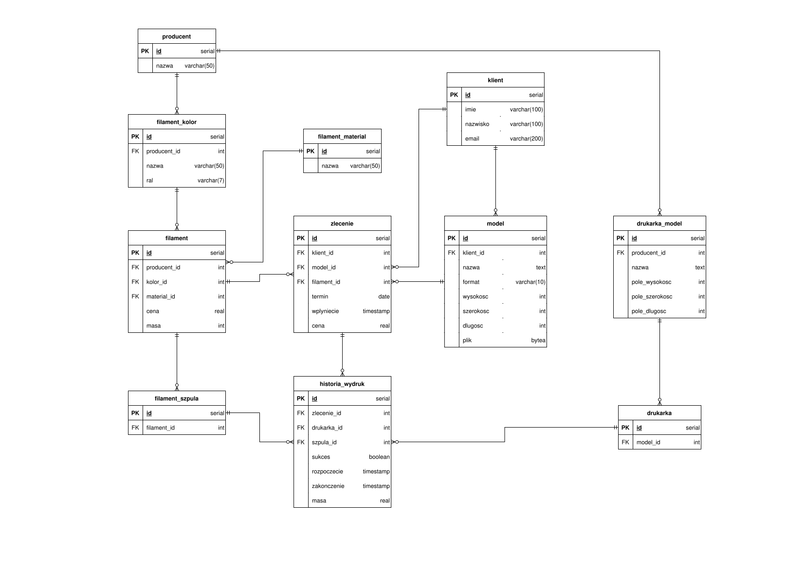

# Projekt bazy danych dla farmy drukarek 3D

Baza danych umożliwia śledzenie aktualnych zleceń i użycia drukarek 3D. Przeznaczona jest dla małych i średnich farm drukarek 3D.

## Założenia

- Zlecenie ma określony materiał z którego detal ma zostać wydrukowany oraz, poprzez model, wymagany rozmiar pola roboczego drukarki.
- Wydruk obejmuje tylko pojedynczy egzemplarz modelu.
- Zlecenie obejmuje wydruk tylko jednego egzemplarza modelu.
- Zlecenie posiada tylko jeden udany wydruk
- Ten sam model może być użyty przy wielu zleceniach.
- Model drukarki posiada ograniczenia w postaci wymiarów pola roboczego i może drukować tylko modele się w nim mieszczące.
- Masa szpuli filamentu jest określana przy wprowadzaniu do systemu a obecny poziom zużycia określany jest na podstawie zrealizowanych nią wydruków.
- Model filamentu jednoznacznie określa jego kolor, materiał oraz początkową masę nowych szpul.
- Kolor filamentu określa również producenta samego filamentu.
- Kolory o takiej samej nazwie od różnych producentów nie muszą być identyczne.
- Ustawienia są przeznaczone dla połączenia modelu drukarki i filamentu.
- Drukarka może używać tylko jednej szpuli filamentu jednocześnie.
- Filamenty oraz drukarki współdzielą producentów.

## Diagram ERD



## Przykładowe użycie

1. Drukarki posortowane według całkowitego zużytego przez nie filamentu

    ```sql
    SELECT
      drukarka_id,
      producent.nazwa AS producent,
      drukarka_model.nazwa AS model,
      SUM(masa) AS suma_masa
    FROM
      historia_wydruk
      LEFT JOIN drukarka ON historia_wydruk.drukarka_id = drukarka.id
      LEFT JOIN drukarka_model ON drukarka.model_id = drukarka_model.id
      LEFT JOIN producent ON drukarka_model.producent_id = producent.id
    GROUP BY
      drukarka_id,
      producent.nazwa,
      drukarka_model.nazwa
    ORDER BY
      suma_masa DESC;
    ```

2. Klienci, którzy złożyli zamówienia używając danego materiału od producenta

    ```sql
    SELECT DISTINCT
      klient.id,
      klient.imie,
      klient.nazwisko,
      klient.email,
      filament_material.nazwa AS material,
      producent.nazwa AS producent
    FROM
      zlecenie
      LEFT JOIN klient ON zlecenie.klient_id = klient.id
      LEFT JOIN filament ON zlecenie.filament_id = filament.id
      LEFT JOIN filament_material ON filament.material_id = filament_material.id
      LEFT JOIN filament_kolor ON filament.kolor_id = filament_kolor.id
      LEFT JOIN producent ON filament_kolor.producent_id = producent.id
    WHERE
      filament_material.nazwa = 'PETG'
      AND producent.nazwa = 'Fiberlogy';
    ```

3. Obecnie zajęte drukarek

    ```sql
    SELECT DISTINCT
      drukarka.id,
      producent.nazwa AS producent,
      drukarka_model.nazwa AS model
    FROM
      drukarka
      RIGHT JOIN historia_wydruk ON drukarka.id = historia_wydruk.drukarka_id
      LEFT JOIN drukarka_model ON drukarka.model_id = drukarka_model.id
      LEFT JOIN producent ON drukarka_model.producent_id = producent.id
    WHERE
      historia_wydruk.zakonczenie IS NULL;
    ```

4. Obecna masa szpul filamentu

    ```sql
    SELECT
      filament_szpula.id,
      filament.masa - SUM(historia_wydruk.masa) AS obecna_masa,
    FROM
      filament_szpula
      LEFT JOIN historia_wydruk ON filament_szpula.id = historia_wydruk.szpula_id
      LEFT JOIN filament ON filament_szpula.filament_id = filament.id
        GROUP BY filament_szpula.id;
    ```

5. Najczęściej używany materiał filamentu

    ```sql
    SELECT
      filament_material.nazwa AS material,
      SUM(historia_wydruk.masa) AS zuzycie
    FROM
      historia_wydruk
      LEFT JOIN filament_szpula ON historia_wydruk.szpula_id = filament_szpula.id
      LEFT JOIN filament ON filament_szpula.filament_id = filament.id
      LEFT JOIN filament_material ON filament.material_id = filament_material.id
    GROUP BY
      filament_material.nazwa
    ORDER BY
      SUM(historia_wydruk.masa) DESC;
    ```

6. Liczba zleceń miesiąc po miesiącu

    ```sql
    SELECT
      EXTRACT(
        YEAR
        FROM
          wplyniecie
      ) AS rok,
      EXTRACT(
        MONTH
        FROM
          wplyniecie
      ) AS miesiac,
      COUNT(zlecenie.id)
    FROM
      zlecenie
    GROUP BY
      rok,
      miesiac
    ORDER BY
      rok ASC,
      miesiac ASC;
    ```

7. Drukarki z największym procentem nieudanych wydruków

    ```sql
    SELECT
      drukarka.id,
      drukarka_model.nazwa,
      COALESCE(t.fail, 0) AS fail,
      COALESCE(v.total, 0) AS total,
      CASE
        WHEN COALESCE(v.total, 0) > 0 THEN (COALESCE(t.fail, 0) * 100 / total::REAL)::REAL
        ELSE NULL
      END AS ratio
    FROM
      drukarka
      LEFT JOIN drukarka_model ON drukarka.model_id = drukarka_model.id
      LEFT JOIN (
        SELECT
          historia_wydruk.drukarka_id,
          COUNT(*) AS fail
        FROM
          historia_wydruk
        WHERE
          historia_wydruk.sukces = FALSE
        GROUP BY
          historia_wydruk.drukarka_id
      ) AS t ON t.drukarka_id = drukarka.id
      LEFT JOIN (
        SELECT
          historia_wydruk.drukarka_id,
          COUNT(*) AS total
        FROM
          historia_wydruk
        GROUP BY
          historia_wydruk.drukarka_id
      ) AS v ON v.drukarka_id = drukarka.id
    ORDER BY
      drukarka.id;
    ```

8. Czas realizacji zlecenia

    ```sql
    SELECT
        zlecenie.id,
        zlecenie.wplyniecie,
        historia_wydruk.zakonczenie,
        EXTRACT(HOUR FROM AGE(historia_wydruk.zakonczenie, zlecenie.wplyniecie)) AS czas_realizacji
    FROM
        zlecenie
        LEFT JOIN historia_wydruk ON zlecenie.id = historia_wydruk.zlecenie_id
        AND historia_wydruk.sukces = TRUE
    ORDER BY
        zlecenie.wplyniecie
    ```

9. Średni dochód ze zlecenia

    ```sql
    SELECT
      AVG(
        zlecenie.cena - t.masa_suma * (filament.cena / filament.masa)::REAL
      ) AS dochod_avg
    FROM
      zlecenie
      LEFT JOIN (
        SELECT
          zlecenie_id,
          SUM(masa) AS masa_suma
        FROM
          historia_wydruk
        GROUP BY
          zlecenie_id
      ) AS t ON t.zlecenie_id = zlecenie.id
      LEFT JOIN filament ON filament.id = zlecenie.filament_id
    ```

10. Dni od ostatniego użycia filamentu

    ```sql
    SELECT
      filament_szpula.id AS szpula_id,
      MAX(historia_wydruk.zakonczenie)
    FROM
      filament
      LEFT JOIN filament_szpula ON filament.id = filament_szpula.filament_id
      LEFT JOIN historia_wydruk ON filament_szpula.id = historia_wydruk.szpula_id
    GROUP BY filament_szpula.id;
    ```
