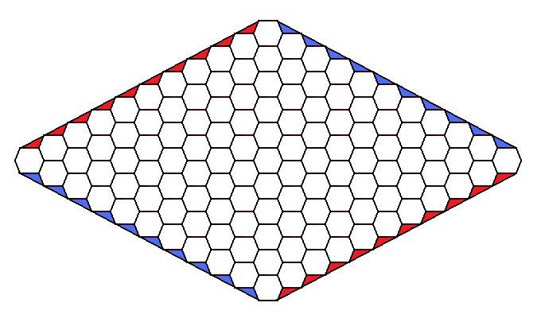

# Hex

Klasyczny wariant gry Hex rozgrywany jest na heksagonalnej planszy o rozmiarach 11 x 11/The classic variant of the game Hex is played on an 11 x 11 hexagonal board:  
  
Zasady gry są następujące:

- Rozgrywka jest prowadzona przez dwóch graczy (czerwonego i niebieskiego).
- Rozpoczynającym jest gracz czerwony.
- Gracze wykonują kolejno ruchy polegające na postawieniu pionka swojego koloru na dowolnym, dotychczas nie zajętym polu.
- Ten z graczy, który połączy ciągłą linią dwa brzegi planszy własnego koloru wygrywa.

Więcej informacji na temat tej gry można znaleźć [tutaj](<https://en.wikipedia.org/wiki/Hex_(board_game)>)

---

Rules of the game are as follows:

- The game is played by two players (red and blue).
- The starting player is the red player.
- Players take turns placing a piece of their color on any unoccupied space.
- The player who forms a continuous line connecting two edges of the board with their own color wins.

More information about this game can be found [here](<https://en.wikipedia.org/wiki/Hex_(board_game)>).

## Wejście/Input

Ciąg przypadków testowych, każdy z nich zaczyna się rysunkiem zawartości planszy oraz serią zapytań. Rozmiar planszy może wahać się od 1 do 11. Obecność pionka koloru czerwonego (gracz rozpoczynający) oznaczono literą: "r", a niebieskiego literą "b". Przykładowe plansze mogą wyglądać następująco:

---

A sequence of test cases, each starting with a drawing of the board's contents followed by a series of queries. The size of the board can vary from 1 to 11. The presence of a red (starting player) pawn is denoted by the letter "r", and a blue pawn by the letter "b". Sample boards may look like this:

**1.**

```
     ---
    < r >
     ---
```

**4.**

```
              ---
           --<   >--
        --< b >-<   >--
     --< r >-<   >-<   >--
    < b >-< b >-<   >-< r >
     --<   >-< r >-< b >--
        --<   >-< r >--
           --<   >--
              ---
```

**11.**

```
                                   ---
                                --<   >--
                             --<   >-< b >--
                          --<   >-<   >-<   >--
                       --<   >-<   >-<   >-<   >--
                    --<   >-<   >-<   >-< b >-< r >--
                 --<   >-<   >-<   >-<   >-<   >-< r >--
              --<   >-<   >-<   >-<   >-< r >-<   >-<   >--
           --< b >-< r >-< r >-<   >-<   >-< b >-<   >-< b >--
        --<   >-<   >-<   >-<   >-< r >-<   >-<   >-< b >-<   >--
     --<   >-< b >-< r >-< r >-< r >-< b >-<   >-<   >-<   >-< r >--
    < b >-<   >-<   >-<   >-<   >-<   >-< b >-<   >-<   >-<   >-< r >
     --< r >-<   >-< b >-< b >-< b >-<   >-<   >-<   >-< b >-< r >--
        --<   >-< r >-< r >-<   >-< b >-< r >-<   >-<   >-<   >--
           --< r >-< b >-<   >-< r >-<   >-<   >-<   >-<   >--
              --<   >-< r >-<   >-<   >-<   >-<   >-<   >--
                 --<   >-< r >-< b >-<   >-< r >-< b >--
                    --< r >-< r >-<   >-<   >-< r >--
                       --<   >-<   >-<   >-< b >--
                          --<   >-<   >-<   >--
                             --<   >-<   >--
                                --< b >--
                                   ---
```

Zapytanie może mieć następującą postać/A query can take the following form:

- **(8 %)** `BOARD_SIZE` - [(przykładowe wejście/sample input - test 1)](../test/0.in.txt)
- **(8 %)** `PAWNS_NUMBER` - [(przykładowe wejście/sample input - test 2)](../test/2.in.txt)
- **(8 %)** `IS_BOARD_CORRECT` - [(przykładowe wejście/sample input - test 3)](../test/4.in.txt)
- **(20 %)** `IS_GAME_OVER` - [(przykładowe wejście/sample input - test 4)](../test/6.in.txt)
- **(20 %)** `IS_BOARD_POSSIBLE` - [(przykładowe wejście/sample input - test 5)](../test/11.in.txt)
- **(20 %)** `CAN_RED_WIN_IN_1_MOVE_WITH_NAIVE_OPPONENT`  
   `CAN_BLUE_WIN_IN_1_MOVE_WITH_NAIVE_OPPONENT`  
   `CAN_RED_WIN_IN_2_MOVES_WITH_NAIVE_OPPONENT`  
   `CAN_BLUE_WIN_IN_2_MOVES_WITH_NAIVE_OPPONENT` - [(przykładowe wejście/sample input - test 6)](../test/16.in.txt)
- **(16 %)** `CAN_RED_WIN_IN_1_MOVE_WITH_PERFECT_OPPONENT`  
   `CAN_BLUE_WIN_IN_1_MOVE_WITH_PERFECT_OPPONENT`  
   `CAN_RED_WIN_IN_2_MOVES_WITH_PERFECT_OPPONENT`  
   `CAN_BLUE_WIN_IN_2_MOVES_WITH_PERFECT_OPPONENT` - [(przykładowe wejście/sample input - test 7)](../test/21.in.txt)

## Wyjście/Output

Ciąg odpowiedzi, przynajmniej jedna na każdy przypadek testowy, rozdzielonych białym znakiem. Możliwe odpowiedzi dla każdego z przypadków testowych są następujące:

- `BOARD_SIZE` - liczba z przedziału <1;11> określająca rozmiar planszy. [(przykładowe wyjście/sample output - test 1)](../test/0.out.txt)
- PAWNS_NUMBER - liczba z przedziału <0;121> określająca liczbę pionów obydwu graczy znajdującą się na planszy. [(przykładowe wyjście/sample output - test 2)](../test/2.out.txt)
- `IS_BOARD_CORRECT` - odpowiedź w postaci YES/NO oznaczająca czy stan planszy jest poprawny, innymi słowy czy liczba pionów jednego z graczy jest odpowiednia w stosunku liczby pionów drugiego gracza. [(przykładowe wyjście/sample output - test 3)](../test/4.out.txt)
- `IS_GAME_OVER` - odpowiedź w postaci YES RED/YES BLUE/NO oznaczająca, czy (i jeśli tak, to który) z graczy zakończył rozgrywkę, czy połączył dwa należące do niego boki planszy nieprzerwaną ścieżką swojego koloru. [(przykładowe wyjście/sample output - test 4)](../test/6.out.txt)
- `IS_BOARD_POSSIBLE` odpowiedź w postaci YES/NO oznaczająca, czy stan planszy jest możliwy. Oznacza to, że plansza jest poprawna i że osiągnięcie takiego stanu nie oznaczało przeoczenia wcześniejszej wygranej jednego z graczy. [(przykładowe wyjście/sample output - test 5)](../test/11.out.txt)
- `CAN_RED_WIN_IN_N_MOVE_WITH_NAIVE_OPPONENT` (...) - odpowiedź w postaci YES/NO oznaczająca, czy jeden z graczy może w N (gdzie N należy do <1;2>) posunięciach zakończyć rozgrywkę grając z naiwnym przeciwnikiem (wykonującym najgorsze możliwe dla siebie posunięcia). Liczba posunięć N oznacza liczbę posunięć gracza, dla którego rozpatrujemy wygraną. Wygrana musi nastąpić w N-tym posunięciu co oznacza, że gracz musi mieć możliwość wykonania takiej liczby posunięć.  
  Przykładowo, jeśli sprawdzamy czy gracz czerwony może wygrać w N = 2 posunięciach i aktualny ruch należy do gracza niebieskiego, to obydwaj gracze wykonają dwa posunięcia. W przypadku gdy aktualny ruch należy do gracza czerwonego to gracz czerwony wykona dwa posunięcia a niebieski tylko jedno. [(przykładowe wyjście/sample output - test 6)](../test/16.out.txt)
- `CAN_RED_WIN_IN_N_MOVE_WITH_PERFECT_OPPONENT` (...) - analogiczny przypadek do poprzedniego z tą różnicą, że gracz sprawdza czy może zakończyć rozgrywkę grając z doskonałym przeciwnikiem (wykonującym najlepsze możliwe dla siebie posunięcia) w N (gdzie N należy do <1;2>) posunięciach. [(przykładowe wyjście/sample output - test 7)](../test/21.out.txt)

Jeśli gracz wygrywa w jednym posunięciu to nie oznacza, że automatycznie wygrywa w dwóch posunięciach. W przypadku kiedy gra z graczem doskonałym i jeśli nie wykona w pierwszym swoim ruchu jedynego posunięcia które prowadzi do jego wygranej to przeciwnik w kolejnym posunięciu może mu je zablokować (patrz: [ciekawy przypadek nr. 3](#3)). Zakładamy, że gracz zawsze gra optymalnie tak aby wygrać w posunięciu o które pytamy (w pierwszym albo drugim), jego przeciwnik gra tak aby wygrać jak najszybciej zatem jeśli może wygrać w pierwszym posunięciu to to zrobi.

Jeśli gracz X wygrywa w N posunięciach z graczem doskonałym Y to Y nie wygrywa nigdy z X (w żadnej możliwej liczbie posunięć).

Uwaga !!! - dla przypadków od trzeciego do siódmego, jeśli stan planszy jest niepoprawny (`IS_BOARD_CORRECT`) algorytm zawsze powinien zwrócić: `NO`.

Dla ostatnich dwóch przypadków można zastosować algorytm [Mini-Max](https://pl.wikipedia.org/wiki/Algorytm_min-max). Dla danej pozycji należy wygenerować wszystkie posunięcia 1-szego gracza a później wszystkie odpowiedzi jego przeciwnika i tak dalej. Maksymalnie takie drzewo może się zagłębić na 4 poziomy (przypadek kiedy rozpatrujemy 2 posunięcia gracza do którego nie należy posunięcie). Trzeba mieć oczywiście zaimplementowany generator wszystkich możliwych posunięć generujący tablicę/listę kolejnych stanów gry z dodanym nowym pionkiem i zmienionym aktualnym graczem oraz detektor końca rozgrywki (jak gracz połączy obydwa końce planszy).

---

A sequence of responses, at least one for each test case, separated by whitespace. Possible responses for each test case are as follows:

- `BOARD_SIZE` - a number from the range <1;11> indicating the size of the board. [(sample output - test 1)](../test/0.out.txt)
- PAWNS_NUMBER - a number from the range <0;121> indicating the number of pawns of both players on the board. [(sample output - test 2)](../test/2.out.txt)
- `IS_BOARD_CORRECT` - a `YES`/`NO` response indicating whether the state of the board is correct, in other words, whether the number of pawns of one player is appropriate relative to the number of pawns of the other player. [(sample output - test 3)](../test/4.out.txt)
- `IS_GAME_OVER` - a `YES RED`/`YES BLUE`/`NO` response indicating whether (and if so, which) player has ended the game, i.e., whether they have connected two edges of the board with an uninterrupted path of their color. [(sample output - test 4)](../test/6.out.txt)
- `IS_BOARD_POSSIBLE` - a `YES`/`NO` response indicating whether the state of the board is possible. This means that the board is correct and that achieving such a state did not result in overlooking an earlier win by one of the players. [(sample output - test 5)](testsEX/11.out.txt)
- `CAN_RED_WIN_IN_N_MOVE_WITH_NAIVE_OPPONENT` (...) - a `YES`/`NO` response indicating whether one of the players can end the game in N (where N belongs to <1;2>) moves when playing against a naive opponent (making the worst possible moves for themselves). The number of moves N indicates the number of moves by the player for whom we are considering victory. Victory must occur in the Nth move, which means that the player must have the ability to make such a number of moves.  
   For example, if we are checking whether the red player can win in N = 2 moves and the current move belongs to the blue player, both players will make two moves. In the case where the current move belongs to the red player, the red player will make two moves and the blue player only one. [(sample output - test 6)](../test/16.out.txt)
- `CAN_RED_WIN_IN_N_MOVE_WITH_PERFECT_OPPONENT` (...) - analogous case to the previous one, with the difference that the player checks whether they can end the game playing against a perfect opponent (making the best possible moves for themselves) in N (where N belongs to <1;2>) moves. [(sample output - test 7)](../test/21.out.txt)

If a player wins in one move, it does not mean that they automatically win in two moves. In the case where they play against a perfect opponent and if they do not make the only move that leads to their victory in their first move, the opponent can block them in the next move (see: [interesting case no. 3](#3)). We assume that the player always plays optimally to win in the move we are asking about (first or second), and their opponent plays to win as quickly as possible, so if they can win in the first move, they will.

If player X wins in N moves against a perfect opponent Y, then Y never wins against X (in any possible number of moves).

Note!!! - for cases from the third to the seventh, if the state of the board is incorrect (`IS_BOARD_CORRECT`), the algorithm should always return: `NO`.

For the last two cases, you can apply the Mini-Max algorithm. For a given position, generate all moves for the first player, and then all responses for their opponent, and so on. This tree can be maximally nested to 4 levels (the case when we consider 2 moves for the player whose move it is not). You must have, of course, an implemented generator of all possible moves generating an array/list of successive game states with an added new pawn and changed current player, and a game end detector (if a player connects both ends of the board).

## Ciekawe przypadki:/Interesting cases:

### 1.

```
       ---
    --< r >--
 --< b >-<   >--
<   >-< b >-<   >
 --<   >-< r >--
    --< r >--
       ---
```

`CAN_RED_WIN_IN_1_MOVE_WITH_PERFECT_OPPONENT` -> `NO`  
`CAN_BLUE_WIN_IN_1_MOVE_WITH_PERFECT_OPPONENT` -> `NO`  
`CAN_RED_WIN_IN_2_MOVES_WITH_PERFECT_OPPONENT` -> `NO`  
`CAN_BLUE_WIN_IN_2_MOVES_WITH_PERFECT_OPPONENT` -> `YES`

Czerwonemu brakuje jednego pionka do wygranej a niebieskiemu dwóch. Gracz niebieski rozpoczyna i blokuje wygraną czerwonego.

Red is one pawn away from winning while blue is two pawns away. Blue starts and blocks red's victory.

```
       ---
    --< r >--
 --< b >-< b >--
<   >-< b >-<   >
 --<   >-< r >--
    --< r >--
       ---
```

Teraz - po wykonaniu posunięcia - niebieskiemu brakuje tylko jednego pionka do wygranej a czerwony nie może go zablokować. Oznacza to, że niebieski wygrywa w 2 posunięciach.

Now - after move - blue is only one pawn away from winning, and red cannot block it. This means that blue wins in 2 moves.

### 2.

```
       ---
    --< b >--
 --< b >-< b >--
< r >-< b >-< r >
 --< r >-<   >--
    --< r >--
       ---
```

`CAN_RED_WIN_IN_1_MOVE_WITH_NAIVE_OPPONENT` -> `NO`  
`CAN_BLUE_WIN_IN_1_MOVE_WITH_NAIVE_OPPONENT` -> `NO`  
`CAN_RED_WIN_IN_2_MOVES_WITH_NAIVE_OPPONENT` -> `NO`  
`CAN_BLUE_WIN_IN_2_MOVES_WITH_NAIVE_OPPONENT` -> `NO`

Gra jest zakończona, wygrał czerwony zatem nie można już analizować kolejnych posunięć. Czerwony nie może zatem wygrać w jednym posunięciu. Dotyczy to obydwu przypadków (gracza doskonałego i naiwnego).

The game is over, red has won, so there's no need to analyze further moves. Therefore, red cannot win in one move. This applies to both cases (perfect and naive opponent).

### 3.

```
       ---
    --<   >--
 --< b >-<   >--
< b >-< r >-<   >
 --< r >-<  >--
    --< r >--
       ---
```

`CAN_RED_WIN_IN_1_MOVE_WITH_PERFECT_OPPONENT` -> `NO`  
`CAN_BLUE_WIN_IN_1_MOVE_WITH_PERFECT_OPPONENT` -> `YES`  
`CAN_RED_WIN_IN_2_MOVES_WITH_PERFECT_OPPONENT` -> `NO`  
`CAN_BLUE_WIN_IN_2_MOVES_WITH_PERFECT_OPPONENT` -> `NO`

Czerwonemu i niebieskiemu brakuje jednego pionka do wygrania. Gracz niebieski rozpoczyna i wygrywa w jednym posunięciu.

Both red and blue are one pawn away from winning. Blue starts and wins in one move.

```
       ---
    --< b >--
 --< b >-<   >--
< b >-< r >-<   >
 --< r >-<  >--
    --< r >--
       ---
```

Wcale nie oznacza to, że niebieski może wygrać w dwóch posunięciach. Niebieski wykonując dowolny inny ruch, taki aby nie wygrać w pierwszym posunięciu, przegrywa. Załóżmy, że wykonał poniższe posunięcie.

It doesn't mean that blue can't win in two moves. By making any other move that doesn't lead to winning in the first move, blue loses. Let's assume they made the following move.

```
       ---
    --<   >--
 --< b >-< b >--
< b >-< r >-<   >
 --< r >-<   >--
    --< r >--
       ---
```

To czerwony jako, że gra optymalnie wygrywa wykonując posunięcie:

Then red, as it plays optimally, wins by making the move:

```
       ---
    --< r >--
 --< b >-< b >--
< b >-< r >-<   >
 --< r >-<   >--
    --< r >--
       ---
```

### 4.

```
                      ---
                   --<   >--
                --< b >-<   >--
             --<   >-< b >-< r >--
          --< b >-< b >-< r >-<   >--
       --< b >-<   >-< b >-< b >-< r >--
    --< r >-< r >-< r >-< b >-< b >-< r >--
 --< b >-< r >-< r >-< b >-<   >-< r >-< b >--
< r >-< b >-< b >-< r >-< b >-< b >-<   >-< r >
 --< b >-< r >-< r >-<   >-< r >-< r >-< b >--
    --< r >-< r >-< r >-< b >-< b >-< b >--
       --< r >-< b >-< r >-< r >-< r >--
          --< r >-<   >-< b >-<   >--
             --< b >-< r >-< r >--
                --< b >-<   >--
                   --< b >--
                      ---
```

`CAN_RED_WIN_IN_1_MOVE_WITH_PERFECT_OPPONENT` -> `NO`  
`CAN_BLUE_WIN_IN_1_MOVE_WITH_PERFECT_OPPONENT` -> `NO`  
`CAN_RED_WIN_IN_2_MOVES_WITH_PERFECT_OPPONENT` -> `NO`  
`CAN_BLUE_WIN_IN_2_MOVES_WITH_PERFECT_OPPONENT` -> `YES`

Aktualny ruch należy do gracza niebieskiego i wykonuje on posunięcie oznaczone `*`. Teraz ma on możliwość zakończenia ruchu na trzy sposoby: 1, 2 lub 3. Czerwony nie może zablokować tych trzech pól jednym pionem. Mógłby temu zapobiec tylko wtedy gdyby sam mógł zakończyć grę po pierwszym ruchu niebieskiego. Niestety nie dysponuje takim ruchem, zatem niebieski wygrywa w dwóch posunięciach.

The current move belongs to the blue player, and they make a move marked with `*`. Now, they have the opportunity to end their turn in three ways: 1, 2, or 3. Red cannot block these three spaces with one pawn. Red could only prevent this if they could end the game after blue's first move. Unfortunately, red doesn't have such a move, so blue wins in two moves.

```
                      ---
                   --< 1 >--
                --< b >-< 2 >--
             --<   >-< b >-< r >--
          --< b >-< b >-< r >-< 3 >--
       --< b >-<   >-< b >-< b >-< r >--
    --< r >-< r >-< r >-< b >-< b >-< r >--
 --< b >-< r >-< r >-< b >-< >-< r >-< b >--
< r >-< b >-< b >-< r >-< b >-< b >-<   >-< r >
 --< b >-< r >-< r >-<   >-< r >-< r >-< b >--
    --< r >-< r >-< r >-< b >-< b >-< b >--
       --< r >-< b >-< r >-< r >-< r >--
          --< r >-<   >-< b >-<   >--
             --< b >-< r >-< r >--
                --< b >-< * >--
                   --< b >--
                      ---
```

The game is over, red has won, so there's no need to analyze further moves. Therefore, red cannot win in one move. This applies to both cases (perfect and naive opponent).

### 5.

```
       ---
    --<   >--
 --<   >-< b >--
<   >-< r >-< b >
 --< r >-< b >--
    --< r >--
       ---
```

`CAN_RED_WIN_IN_1_MOVE_WITH_NAIVE_OPPONENT`
`CAN_BLUE_WIN_IN_1_MOVE_WITH_NAIVE_OPPONENT`
`CAN_RED_WIN_IN_2_MOVES_WITH_NAIVE_OPPONENT`
`CAN_BLUE_WIN_IN_2_MOVES_WITH_NAIVE_OPPONENT`

Czerwony nie może wygrać w drugim posunięciu bo zawsze wygrywa w pierwszym.

Red cannot win on the second move because he always wins on the first move.

### 6.

```
          ---
       --< r >--
    --< b >-< r >--
 --< b >-< b >-< r >--
< r >-<   >-< r >-< r >
 --< r >-< b >-< b >--
    --< b >-< r >--
       --< b >--
          ---
```

`IS_BOARD_POSSIBLE`

Plansza jest poprawna - pomimo, że są dwie ścieżki gracza czerwonego - można je przerwać zdejmując jeden pionek. Położenie tego pionka przez gracza czerwonego było zatem ostatnim posunięciem.

The board is correct - although there are two paths for the red player - they can be interrupted by removing one pawn. Placing this pawn by the red player was therefore the last move.

## Przykład/Example

### Wejście/Input

```
 ---
<   >
 ---
BOARD_SIZE

PAWNS_NUMBER

IS_BOARD_CORRECT

IS_GAME_OVER

IS_BOARD_POSSIBLE

CAN_RED_WIN_IN_1_MOVE_WITH_NAIVE_OPPONENT
CAN_BLUE_WIN_IN_1_MOVE_WITH_NAIVE_OPPONENT
CAN_RED_WIN_IN_2_MOVES_WITH_NAIVE_OPPONENT
CAN_BLUE_WIN_IN_2_MOVES_WITH_NAIVE_OPPONENT

CAN_RED_WIN_IN_1_MOVE_WITH_PERFECT_OPPONENT
CAN_BLUE_WIN_IN_1_MOVE_WITH_PERFECT_OPPONENT
CAN_RED_WIN_IN_2_MOVES_WITH_PERFECT_OPPONENT
CAN_BLUE_WIN_IN_2_MOVES_WITH_PERFECT_OPPONENT

    ---
 --<   >--
<   >-<   >
 --<   >--
    ---
BOARD_SIZE

PAWNS_NUMBER

IS_BOARD_CORRECT

IS_GAME_OVER

IS_BOARD_POSSIBLE

CAN_RED_WIN_IN_1_MOVE_WITH_NAIVE_OPPONENT
CAN_BLUE_WIN_IN_1_MOVE_WITH_NAIVE_OPPONENT
CAN_RED_WIN_IN_2_MOVES_WITH_NAIVE_OPPONENT
CAN_BLUE_WIN_IN_2_MOVES_WITH_NAIVE_OPPONENT

CAN_RED_WIN_IN_1_MOVE_WITH_PERFECT_OPPONENT
CAN_BLUE_WIN_IN_1_MOVE_WITH_PERFECT_OPPONENT
CAN_RED_WIN_IN_2_MOVES_WITH_PERFECT_OPPONENT
CAN_BLUE_WIN_IN_2_MOVES_WITH_PERFECT_OPPONENT

    ---
 --< r >--
<   >-<   >
 --<   >--
    ---
BOARD_SIZE

PAWNS_NUMBER

IS_BOARD_CORRECT

IS_GAME_OVER

IS_BOARD_POSSIBLE

CAN_RED_WIN_IN_1_MOVE_WITH_NAIVE_OPPONENT
CAN_BLUE_WIN_IN_1_MOVE_WITH_NAIVE_OPPONENT
CAN_RED_WIN_IN_2_MOVES_WITH_NAIVE_OPPONENT
CAN_BLUE_WIN_IN_2_MOVES_WITH_NAIVE_OPPONENT

CAN_RED_WIN_IN_1_MOVE_WITH_PERFECT_OPPONENT
CAN_BLUE_WIN_IN_1_MOVE_WITH_PERFECT_OPPONENT
CAN_RED_WIN_IN_2_MOVES_WITH_PERFECT_OPPONENT
CAN_BLUE_WIN_IN_2_MOVES_WITH_PERFECT_OPPONENT

    ---
 --< b >--
<   >-< r >
 --<   >--
    ---
BOARD_SIZE

PAWNS_NUMBER

IS_BOARD_CORRECT

IS_GAME_OVER

IS_BOARD_POSSIBLE

CAN_RED_WIN_IN_1_MOVE_WITH_NAIVE_OPPONENT
CAN_BLUE_WIN_IN_1_MOVE_WITH_NAIVE_OPPONENT
CAN_RED_WIN_IN_2_MOVES_WITH_NAIVE_OPPONENT
CAN_BLUE_WIN_IN_2_MOVES_WITH_NAIVE_OPPONENT

CAN_RED_WIN_IN_1_MOVE_WITH_PERFECT_OPPONENT
CAN_BLUE_WIN_IN_1_MOVE_WITH_PERFECT_OPPONENT
CAN_RED_WIN_IN_2_MOVES_WITH_PERFECT_OPPONENT
CAN_BLUE_WIN_IN_2_MOVES_WITH_PERFECT_OPPONENT

    ---
 --< r >--
< r >-< b >
 --<   >--
    ---
BOARD_SIZE

PAWNS_NUMBER

IS_BOARD_CORRECT

IS_GAME_OVER

IS_BOARD_POSSIBLE

CAN_RED_WIN_IN_1_MOVE_WITH_NAIVE_OPPONENT
CAN_BLUE_WIN_IN_1_MOVE_WITH_NAIVE_OPPONENT
CAN_RED_WIN_IN_2_MOVES_WITH_NAIVE_OPPONENT
CAN_BLUE_WIN_IN_2_MOVES_WITH_NAIVE_OPPONENT

CAN_RED_WIN_IN_1_MOVE_WITH_PERFECT_OPPONENT
CAN_BLUE_WIN_IN_1_MOVE_WITH_PERFECT_OPPONENT
CAN_RED_WIN_IN_2_MOVES_WITH_PERFECT_OPPONENT
CAN_BLUE_WIN_IN_2_MOVES_WITH_PERFECT_OPPONENT

       ---
    --<   >--
 --< b >-<   >--
< b >-< r >-<   >
 --< r >-<   >--
    --< r >--
       ---
BOARD_SIZE

PAWNS_NUMBER

IS_BOARD_CORRECT

IS_GAME_OVER

IS_BOARD_POSSIBLE

CAN_RED_WIN_IN_1_MOVE_WITH_NAIVE_OPPONENT
CAN_BLUE_WIN_IN_1_MOVE_WITH_NAIVE_OPPONENT
CAN_RED_WIN_IN_2_MOVES_WITH_NAIVE_OPPONENT
CAN_BLUE_WIN_IN_2_MOVES_WITH_NAIVE_OPPONENT

CAN_RED_WIN_IN_1_MOVE_WITH_PERFECT_OPPONENT
CAN_BLUE_WIN_IN_1_MOVE_WITH_PERFECT_OPPONENT
CAN_RED_WIN_IN_2_MOVES_WITH_PERFECT_OPPONENT
CAN_BLUE_WIN_IN_2_MOVES_WITH_PERFECT_OPPONENT

       ---
    --<   >--
 --< b >-< b >--
< r >-< r >-<   >
 --< r >-<   >--
    --<   >--
       ---
BOARD_SIZE

PAWNS_NUMBER

IS_BOARD_CORRECT

IS_GAME_OVER

IS_BOARD_POSSIBLE

CAN_RED_WIN_IN_1_MOVE_WITH_NAIVE_OPPONENT
CAN_BLUE_WIN_IN_1_MOVE_WITH_NAIVE_OPPONENT
CAN_RED_WIN_IN_2_MOVES_WITH_NAIVE_OPPONENT
CAN_BLUE_WIN_IN_2_MOVES_WITH_NAIVE_OPPONENT

CAN_RED_WIN_IN_1_MOVE_WITH_PERFECT_OPPONENT
CAN_BLUE_WIN_IN_1_MOVE_WITH_PERFECT_OPPONENT
CAN_RED_WIN_IN_2_MOVES_WITH_PERFECT_OPPONENT
CAN_BLUE_WIN_IN_2_MOVES_WITH_PERFECT_OPPONENT

       ---
    --<   >--
 --<   >-< b >--
<   >-< r >-< b >
 --< r >-< b >--
    --< r >--
       ---
BOARD_SIZE

PAWNS_NUMBER

IS_BOARD_CORRECT

IS_GAME_OVER

IS_BOARD_POSSIBLE

CAN_RED_WIN_IN_1_MOVE_WITH_NAIVE_OPPONENT
CAN_BLUE_WIN_IN_1_MOVE_WITH_NAIVE_OPPONENT
CAN_RED_WIN_IN_2_MOVES_WITH_NAIVE_OPPONENT
CAN_BLUE_WIN_IN_2_MOVES_WITH_NAIVE_OPPONENT

CAN_RED_WIN_IN_1_MOVE_WITH_PERFECT_OPPONENT
CAN_BLUE_WIN_IN_1_MOVE_WITH_PERFECT_OPPONENT
CAN_RED_WIN_IN_2_MOVES_WITH_PERFECT_OPPONENT
CAN_BLUE_WIN_IN_2_MOVES_WITH_PERFECT_OPPONENT

          ---
       --< b >--
    --< r >-< b >--
 --< r >-< r >-< b >--
< b >-< b >-< r >-< b >
 --< r >-< b >-< b >--
    --< r >-< r >--
       --< r >--
          ---
BOARD_SIZE

PAWNS_NUMBER

IS_BOARD_CORRECT

IS_GAME_OVER

IS_BOARD_POSSIBLE

CAN_RED_WIN_IN_1_MOVE_WITH_NAIVE_OPPONENT
CAN_BLUE_WIN_IN_1_MOVE_WITH_NAIVE_OPPONENT
CAN_RED_WIN_IN_2_MOVES_WITH_NAIVE_OPPONENT
CAN_BLUE_WIN_IN_2_MOVES_WITH_NAIVE_OPPONENT

CAN_RED_WIN_IN_1_MOVE_WITH_PERFECT_OPPONENT
CAN_BLUE_WIN_IN_1_MOVE_WITH_PERFECT_OPPONENT
CAN_RED_WIN_IN_2_MOVES_WITH_PERFECT_OPPONENT
CAN_BLUE_WIN_IN_2_MOVES_WITH_PERFECT_OPPONENT

                               ---
                            --<   >--
                         --<   >-<   >--
                      --<   >-<   >-<   >--
                   --< r >-<   >-<   >-< b >--
                --<   >-<   >-<   >-<   >-<   >--
             --<   >-< r >-<   >-<   >-< b >-<   >--
          --<   >-<   >-< r >-<   >-< b >-<   >-<   >--
       --<   >-<   >-<   >-< r >-< b >-<   >-<   >-<   >--
    --<   >-<   >-<   >-<   >-<   >-<   >-<   >-<   >-<   >--
 --<   >-<   >-<   >-<   >-<   >-<   >-<   >-<   >-<   >-<   >--
<   >-<   >-<   >-<   >-<   >-<   >-<   >-<   >-<   >-<   >-<   >
 --<   >-<   >-<   >-<   >-< b >-< r >-<   >-<   >-<   >-<   >--
    --<   >-<   >-<   >-< b >-<   >-<   >-<   >-<   >-<   >--
       --<   >-<   >-<   >-<   >-< r >-<   >-<   >-<   >--
          --<   >-<   >-< b >-<   >-< r >-<   >-<   >--
             --<   >-<   >-<   >-<   >-<   >-<   >--
                --<   >-< b >-<   >-< r >-<   >--
                   --< b >-<   >-<   >-< r >--
                      --<   >-<   >-<   >--
                         --<   >-<   >--
                            --<   >--
                               ---
BOARD_SIZE

PAWNS_NUMBER

IS_BOARD_CORRECT

IS_GAME_OVER

IS_BOARD_POSSIBLE

CAN_RED_WIN_IN_1_MOVE_WITH_NAIVE_OPPONENT
CAN_BLUE_WIN_IN_1_MOVE_WITH_NAIVE_OPPONENT
CAN_RED_WIN_IN_2_MOVES_WITH_NAIVE_OPPONENT
CAN_BLUE_WIN_IN_2_MOVES_WITH_NAIVE_OPPONENT

CAN_RED_WIN_IN_1_MOVE_WITH_PERFECT_OPPONENT
CAN_BLUE_WIN_IN_1_MOVE_WITH_PERFECT_OPPONENT
CAN_RED_WIN_IN_2_MOVES_WITH_PERFECT_OPPONENT
CAN_BLUE_WIN_IN_2_MOVES_WITH_PERFECT_OPPONENT
```

### Wyjście/Output

```
1

0

YES

NO

YES

YES
NO
NO
NO

YES
NO
NO
NO

2

0

YES

NO

YES

NO
NO
YES
YES

NO
NO
YES
NO

2

1

YES

NO

YES

YES
NO
NO
YES

YES
NO
NO
NO

2

2

YES

NO

YES

NO
YES
NO
NO

NO
YES
NO
NO

2

3

YES

NO

YES

NO
YES
NO
NO

NO
YES
NO
NO

3

5

YES

NO

YES

YES
YES
YES
YES

NO
YES
NO
NO

3

5

YES

NO

YES

YES
NO
YES
YES

YES
NO
NO
NO

3

6

YES

NO

YES

YES
NO
NO
NO

YES
NO
NO
NO

4

16

YES

YES RED

NO

NO
NO
NO
NO

NO
NO
NO
NO

11

18

YES

NO

YES

NO
NO
YES
YES

NO
NO
YES
NO
```
